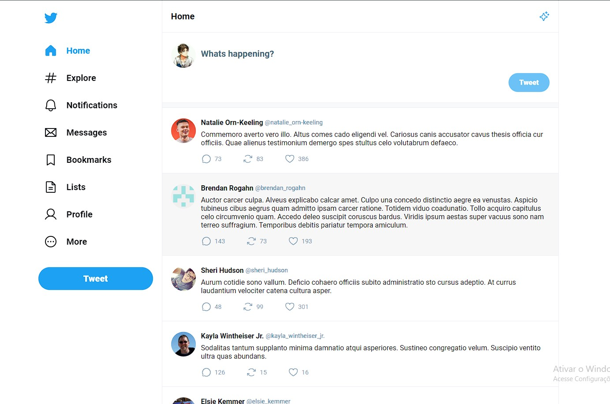
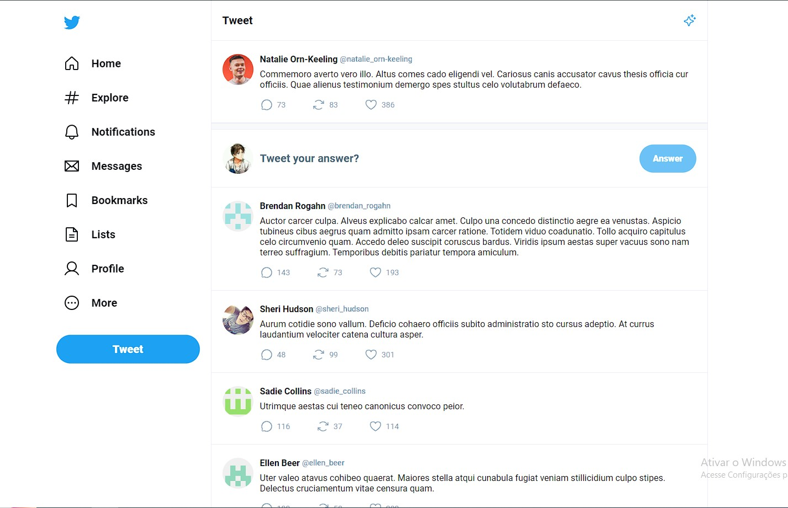
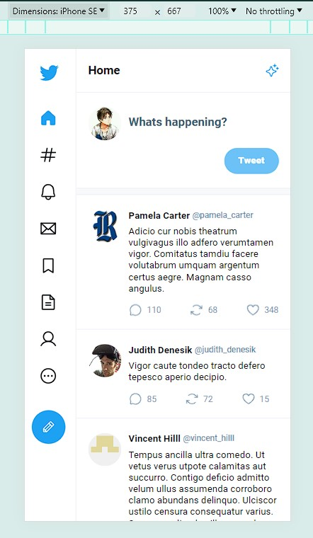
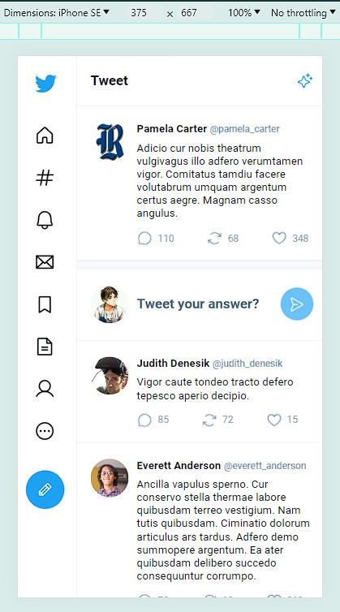

# Twitter-ui

Esse é um projeto front-end, tentando copiar um pouco o layout do [twitter](https://x.com)

Esse projeto tem como finalidade, desenvolver minhas habilidades front-end, como criação de interfaces bem estilizadas e praticando responsividade no app, além de praticar o desenvolvimento de aplicações SPA (Single Page Application) com React.

## Índice

- [Funcionamento do App](#funcionamento-do-app)
- [Detalhes](#detalhes)
- [Especificações das Tencologias](#especificações-das-tecnologias)
- [Lógica da Aplicação](#lógica-da-aplicação)
- [Interface](#interface)

## Funcionamento do App

É um mini twitter, onde um usuário do app pode ver publicações dos outros usuários.

Pode entrar na página de um tweet/post específico, tendo acesso a todas respostas/comentários feitos daquele tweet.

Na página inicial, na "timeline", é possível postar uma publicação que ficará disponível para outros usuários.

As publicações, nesse projeto, só permite textos.

Os outros usuários podem comentar na sua publicação.

## Detalhes

É um app focado na criação do visual em si, e na boa utilização do React, em componentes, estados, roteamento sem redirecionamentos...

É uma aplicação muito simples, portanto muitas funcionalidades que o tornaria um projeto mais interessante foi deixado de lado, como as interações com cada tweet postado, os botões de like, retweet e comentarios, não são clicáveis e os números são fictícios.

Não possui um back-end, então os dados é apenas um array contendo as informações para gerar a interface, com dados fakes e randomizados gerados através da biblioteca "[faker.js](https://fakerjs.dev/)".

Essa é uma aplicação construída em uma masterclass da rockeatseat.

## Especificações das Tecnologias

Node.js como ambiente de execução.
- **v20.6.1**

Typescript, adicionando tipagem estática.
- **typescript@5.4.4**: Com ele é possível detectar erros de tipo em tempo de compilação, melhorando a legibilidade do código e facilitando a manutenção; 

Vite, uma biblioteca que utilizei para criar meu projeto React.
- **vite@5.2.8**: Oferece uma experiência de desenvolvimento extremamente rápida para projetos front-end, graças ao seu carregamento instantâneo de módulos e compilação otimizada. Ele oferece recursos muito eficientes para o desenvolvimento de apps como o "Fast Reload" e "Hot Module Replacement" (HMR);

- **@vitejs/plugin-react@4.2.1**: É um plugin para o Vite, um empacotador de módulos para o desenvolvimento de aplicativos web modernos. Esse plugin oferece suporte específico para o React, ele otimiza a compilação e o carregamento dos componentes React;

React, uma biblioteca front-end para construir interfaces.

- **react@18.2.0**: O React é uma biblioteca JavaScript de código aberto que é usada para criar interfaces de usuário, especialmente para aplicativos de página única (SPA).
Introduziu o JSX, onde é possível utilizar sintaxe do HTML direto do javascirpt, se tornando possível que os desenvolvedores criem componentes visuais customizados e reutilizáveis;

- **react-dom@18.2.0**: É uma biblioteca complementar ao React que fornece métodos específicos para lidar com a renderização de componentes React no navegador. Ela é responsável por converter os elementos React em instruções que o navegador pode entender e exibir na tela;

Phosphor, biblioteca de ícones.
- **phosphor-react@1.4.1**: É uma biblioteca de ícones SVG para React que são usados como componentes React, oferece uma ampla variedade de ícones, que podem ser estilizados e personalidados tranquilamente.

Faker js, uma biblioteca para me prover dados randomizados.
- **@faker-js/faker@8.4.1**: Permite gerar dados aleatórios de forma realista e personalizada para facilitar o desenvolvimento e testes de aplicações. Com o Faker, os desenvolvedores podem criar dados simulados, como nomes, endereços, números de telefone, endereços de e-mail e muito mais, de acordo com suas necessidades.

## Lógica da aplicação

Não possui um back-end, ou seja, os dados são guardados em memória apenas.

A aplicação inicia um array de 30 objetos contendo informações para exibir os tweets, aqui está mais detalhadamente cada propriedade e o método do faker js usado para gerar aquele dado:

**id**: o ID do tweet utilizando a estratégia do uuid, **faker.string.uuid()**.

**userName**: Nome do usuário, **faker.person.fullName()**.

**userImage**: Foto de perfil do usuário, **faker.image.avatar()**.

**atSign**: O arroba do usuário, **"@"+userName.replace(/[\s]/gui, "_")**, que nada mais era que o nome completo do usuário, com um arroba no começo e com "_" no lugar do espaço em branco entre o nome e o sobrenome.

**content**: O conteúdo da publicação, **faker.lorem.text()**, que cria um texto bem aleatório.

**likes, comentarys e retweets**: Apenas representando a quantidade de cada interação que aquela publicação teve, **faker.number.int({min: 0, max: 100})**.

**answerTo**: É para no caso desse tweet ter sido uma respota a outro tweet, é null caso não seja resposta a nenhuma publicação, e fica o ID do outro tweet.

Esses foram os dados que eu utilizei para apresentar os tweets em tela.

Na masterclass foram apresentadas soluções prontas para rosolver o roteamento sem recarregar a página toda, como o "react-router-dom". <br>Porém eu quis tentar minha própria solução, não tentando disputar com "react-router-dom" e nenhuma outra, pois eu quis não usar uma solução pronta, com o objetivo de entender melhor mais ou menos como funcionaria "trocar de página" em uma aplicação SPA.

Criei um função que chamei de "useRouterDom", eu tentei seguir mais ou menos como funciona um hook em React. Essa função retorna um vetor com 3 itens, os 2 primeiros são essenciais e o terceiro depende do caso. Então pode ser utilizado desestruturação que nem com o "useState".

```js
export function App(){
    const [ Router, setCurrentPath, currentPath ] = useRouterDom();
...
```
O primeiro item do array, é um componente React "Router", em que ele renderizara o componente com base na URL da aplicação;

```js
...
<div className="layout">
    <Sidebar active={currentPath === res("/") ? "home" : ""} setRouter={setCurrentPath} />
    <main>
        <Header title={currentPath === res("/") ? "Home" : "Tweet"} />
        <Router
            optionalRouters={[
            {
                path: "/",
                element: Timeline,
                setRouter: setCurrentPath
            },
            {
                path: "/status/:tweetId", 
                element: TweetStatus,
                setRouter: setCurrentPath, 
                hasRouteParam: true
            },
            {
                path: "?",
                element: NotFound,     
            }
        ]} />
    </main>
</div>
...
```
No caso do twitter-ui, eu sabia que a sidebar e o header praticamente não iria mudar de uma página para outra, então utilizei o Router apenas onde iria ser necessário.<br>
Na props do componente é necessário passar o "optionalRouters", que é passado um array com cada rota (path), e a função que retorna o HTML daquela página, no caso o componente mas sem utilizar a sintaxe JSX, pois deixei essa responsabilidade para o Router.<br> Opcionalmente você pode passar o "setRouter" que é o segundo item do array, e também uma propriedade chamada "hasRouteParam" para no caso se tiver algum parâmetro de rota, eu utilizei no "/status/:tweetId", em que ele aceita qualquer valor depois de '/status/', e esse valor é passado pelo o Router, para o elemento que será renderizado, com um objeto naquele caso, o **{ tweetId: "valor" }** para a propriedade "routeParams" que o elemento que será renderizado deve ter.<br>
Você também tem a opção de por o "path" como '?', o Router entenderá que se a URL não cair em nenhuma das outras do "optionalRouters", ele renderizará aquele elemento.

O segundo item do array, é uma função, em que ela deverá ser utilizada para redirecionar a página para a URL desejada, com isso o Router também fará mudar o seu conteúdo para a página desejava.
```js
<Sidebar 
    active={currentPath === "/" ? "home" : ""} 
    setRouter={setCurrentPath} 
/>
```
Por isso eu passava essa função para os outros componentes, para que eles poder utilizar o roteamento nos componentes de dentro deles.

Já é possível utilizar esse exemplo para explicar o último item do array de retorno do meu useRouterDom, que é uma variável de estado que representa o valor atual do path da URL, sempre que utiliza o "setRouter" ele já atualiza essa variável, e ele tem o mesmo funcionamento que uma variável de estado então é possível utilizar para mostrar certos componentes ou propriedades dependendo da rota atualq que a página está.

## Interface

Você pode testar a aplicação [clicando aqui](https://github.com/LucasLessaAnacleto/).

Basicamente esse projeto é composto por duas páginas, sendo a principal a timeline das publicações e quando clica em algum tweet, onde é redirecionado para a página do tweet em si.

Timeline:


<br><br>

Um tweet específico:


<br><br>

Timeline com dimensão mobile:


<br><br>

Um tweet específico com dimensão mobile:

